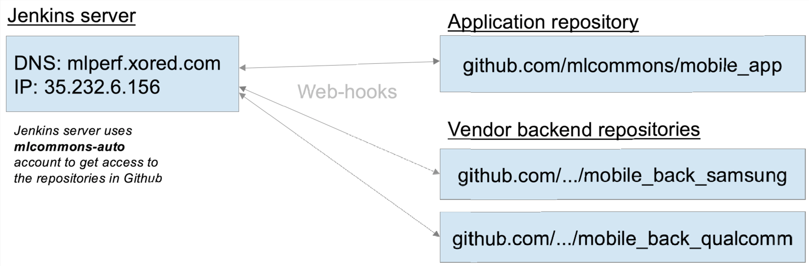
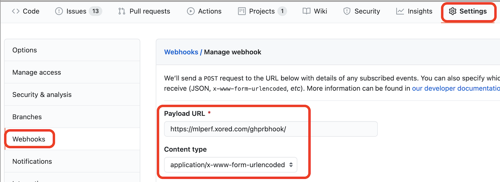

# CI workflow
---
## Network scheme

---
## Web-hooks settings

---
## Workflow scenarios

1. PULL REQUEST to the application repository
2. MERGE to the master branch of the application repository
3. MERGE to the master branch of the vendor backend repository
4. Manual building specific branch
---
## PULL REQUEST to the application repository
1. User makes PULL REQUEST to the application repository
2. Jenkins runs jobs:
    - **mobile_app/PullRequest-CodeFormattingCheck** (checks code formatting)
    - **mobile_app/PullRequest-Build** (builds APKs)
3. After **mobile_app/PullRequest-Build**, Jenkins runs jobs:
    - **mobile_app/PullRequest-runCrawlerTests** (“monkey” test)
    - **mobile_app/PullRequest-runInstrumentTests** (instrumented test on physical device in Google Firebase TestLab)
    - **mobile_app/PullRequest-runLocalTests** (instrumented test on VM)
---
## MERGE to the master branch of the application repository
1. User makes MERGE to the master branch of the application repository
2. Jenkins runs jobs:
    - **mobile_app/MasterBuild** (builds APKs)
3. **mobile_app/MasterBuild** collects backends artefacts from jobs:
    - **mobile_back_samsung/MasterBuild**
    - **mobile_back_qualcomm/MasterBuild-Qualcomm**
4. **mobile_app/MasterBuild** builds APK
5. After **mobile_app/MasterBuild**, Jenkins runs jobs:
    - **mobile_app/MasterBuild-runCrawlerTests** (“monkey” test)
    - **mobile_app/MasterBuild-runInstrumentTests** (instrumented test on physical device in Google Firebase TestLab)
    - **mobile_app/MasterBuild-runLocalTests** (instrumented test on VM)
---
## MERGE to the master branch of the Samsung backend repository
1. User makes MERGE to the master branch of the Samsung backend repository
2. Jenkins runs job **mobile_back_samsung/MasterBuild** (makes archive with artefacts)
3. After **mobile_back_samsung/MasterBuild**, Jenkins runs job **mobile_app/MasterBuild** (for rebuilding application APK)
---
## MERGE to the master branch of the QTI backend repository
1. User makes MERGE to the master branch of the QTI backend repository
2. Jenkins runs job **mobile_back_qualcomm/MasterBuild** (builds backend, makes archive with artefacts)
3. After **mobile_back_qualcomm/MasterBuild**, Jenkins runs job **mobile_app/MasterBuild** (for rebuilding application APK)
---
## Manual building
1. Authorized user runs Jenkins job **mobile_app/Build-versioned-branch** with specific branch name as parameter
2. **mobile_app/Build-versioned-branch** runs jobs for building backends from specified branch:
    - **mobile_back_qualcomm/BranchBuild-Qualcomm**
    - **mobile_back_samsung/BranchBuild-Samsung**
3. **mobile_app/Build-versioned-branch** builds APK from specified branch