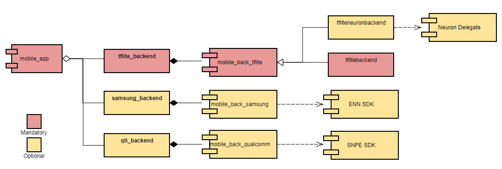

# Building MLPerf App

This page documents the updated workflow for building the MLPerf app. 

## MLPerf App Components
The MLPerf app is build from several optional and one mandatory external repository. It also pulls data from another repository when it runs.


 
## MLPerf App Runtime
The MLPerf app downloads assets via http from https://github.com/mlcommons/mobile_models/tree/main/v1_0/assets and https://github.com/mlcommons/mobile_models/tree/main/v0_7/datasets before it can run its tests. It can optionally use a tasks_v2.pbtxt file on the sdcard if provided and use assets offline from the SD card.

## Building the MLPerf V1.0.3+ App
The build process is a bit confusing because the versions of the components above are decoupled. The build process involves cloning the mobile_app and mobile_back_tflite repos and any other desired optional repos. The mobile_back_samsung repo and the mobile_back_qualcomm repos are private and can only be build by MLCommons or the respective backend owners. The SNPE SDK is publicly available at https://developer.qualcomm.com/software/qualcomm-neural-processing-sdk. The Samsung ENN SDK seems to no longer be available https://developer.samsung.com/neural/overview.html.

## Building MLPerf App mainline development branches
Github changed their default main branch naming from master to main so some repos use master and some use main.

### Building with make
The simplest way to build the app is using make. This will use docker to build the app so docker must be installed on your build host. The docker image will be built from the Dockerfile if needed. Building the docker image may take some time initially, but is only needs to be done once.

To build the latest app with only TFLite backend for aarch64:
```
git clone https://github.com/mlcommons/mobile_app
make app
```
This will clone the main branch of the mobile_back_tflite repo by default.


**To build the app with the latest mainline development branches from all backends:**
```
# Setup any Samsung build deps (this is not publicly documented)
# Download SNPE SDK and unzip (e.g. /opt/snpe-1.48.0.2554)
git clone https://github.com/mlcommons/mobile_app
export SNPE_SDK=/opt/snpe-1.48.0.2554
cd mobile_app
cp -r <Samsung backend build artifacts from desired branch> samsung_backend
make TFLITE_BRANCH=main QTI_BRANCH=master ANDROID_MEDIATEK_BACKEND_BAZEL_FLAG=--//java/org/mlperf/inference:with_mediatek="1" ANDROID_SAMSUNG_BACKEND_BAZEL_FLAG=--//java/org/mlperf/inference:with_samsung="1" app
```

**To build a specific branch for each backend (e.g. v1_0_2):**
```	
# Setup any Samsung build deps (this is not publicly documented)
# Download SNPE SDK and unzip (e.g. /opt/snpe-1.48.0.2554)
git clone -b v1_0_2 https://github.com/mlcommons/mobile_app
export SNPE_SDK=/opt/snpe-1.48.0.2554
cd mobile_app
cp -r <Samsung backend build artifacts from desired branch> samsung_backend
make TFLITE_BRANCH=v1_0_2 QTI_BRANCH=v1_0_2 ANDROID_MEDIATEK_BACKEND_BAZEL_FLAG=--//java/org/mlperf/inference:with_mediatek="1" ANDROID_SAMSUNG_BACKEND_BAZEL_FLAG=--//java/org/mlperf/inference:with_samsung="1" app
```

### Building without make and docker
**To build tflite backend with MediaTek Neuron delegate for arm64-v8a without using make and docker:**
```
# Install bazel 3.7.2 and all other build deps
git clone https://github.com/mlcommons/mobile_app
cd mobile_app
git clone https://github.com/mlcommons/mobile_back_tflite tflite_backend
bazel-3.7.2 --output_user_root=/opt/cache/bazel build \
            -c opt --cxxopt='--std=c++14' --host_cxxopt='--std=c++14'  \
            --host_cxxopt='-Wno-deprecated-declarations' --host_cxxopt='-Wno-class-memaccess' \
            --cxxopt='-Wno-deprecated-declarations' --cxxopt='-Wno-unknown-attributes' \
            --//java/org/mlperf/inference:with_mediatek="1" \
            --fat_apk_cpu=arm64-v8a //java/org/mlperf/inference:mlperf_app
```

**To build Samsung backend for arm64-v8a without using make and docker:**
```
# Setup any Samsung build deps (this is not publicly documented)
# Install bazel 3.7.2 and all other build deps
git clone https://github.com/mlcommons/mobile_app
cd mobile_app
git clone https://github.com/mlcommons/mobile_back_tflite tflite_backend
cp -r <Samsung backend build artifacts from desired branch> samsung_backend
bazel-3.7.2 --output_user_root=/opt/cache/bazel build \
            -c opt --cxxopt='--std=c++14' --host_cxxopt='--std=c++14'  \
            --host_cxxopt='-Wno-deprecated-declarations' --host_cxxopt='-Wno-class-memaccess' \
            --cxxopt='-Wno-deprecated-declarations' --cxxopt='-Wno-unknown-attributes' \
            --//java/org/mlperf/inference:with_samsung="1" \
            --fat_apk_cpu=arm64-v8a //java/org/mlperf/inference:mlperf_app
```

